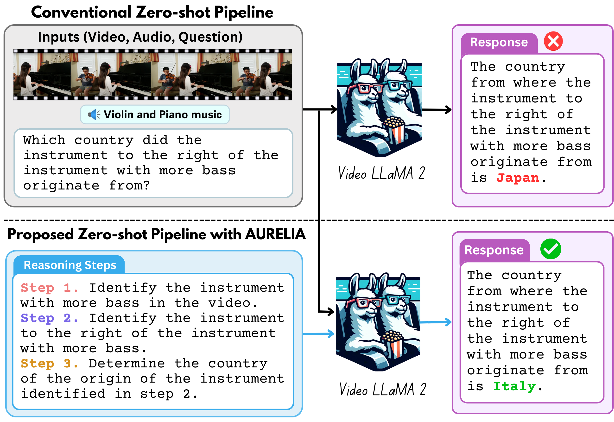

# AURELIA : Test‑time Reasoning Distillation in Audio‑Visual LLMs
[📄 Paper](https://arxiv.org/abs/2503.23219) · [🌐 Project Page](https://schowdhury671.github.io/aurelia_project/)

### AURELIA : Test‑time Reasoning Distillation in Audio‑Visual LLMs is accepted to ICCV 2025!! 🎉🎉

<p align="center">
  
</p>

#### This is the official code for the paper - AURELIA : Test‑time Reasoning Distillation in Audio‑Visual LLMs

We introduce **AURELIA**, a novel actor-critic based audio-visual (AV) reasoning framework that distills structured, step-by-step reasoning into AVLLMs at test time, improving their ability to process complex multi-modal inputs without additional training or fine-tuning. 

---

## Table of Contents
1. [Quick Start](#quick-start)
2. [Generating Reasoning Data](#generating-reasoning-data)
3. [Evaluation](#evaluation)
4. [Citation](#citation)

---

## Quick Start
Clone the repo & install dependencies
```bash
git clone https://github.com/schowdhury671/aurelia
conda create -n aurelia python=3.10 -y
conda activate aurelia
pip install openai==0.28.0
pip install google-generativeai
pip install -q -U pytube moviepy
apt-get install -y ffmpeg
```

To run the multi‑agent pipeline you must export valid keys for both OpenAI and Google Gemini APIs:
```bash
export OPENAI_API_KEY="..."
export GOOGLE_API_KEY="..."
```

---

## Generating Reasoning Data

Run the data generation pipeline
```bash
cd data_generation
python gen_data.py --save_path "reason_data.json" \
                   --video_path "sample.mp4" \
                   --audio_path "sample.mp3" \
                   --query "What is the most popular food of the country where the loudest instrument originates from?" \
                   --max_tries 5
```
`gen_data.py` will iteratively call the chosen LLMs, synthesize the reasoning caption, and stop once the evaluator score ≥ τ.

---

## Evaluation
We benchmark various AV-LLMs following the settings mentioned in Section 5 of the paper.

Given below are the links to the checkpoints of the public AV-LLMs.

| Family | Size | Code & Checkpoint |
|--------|------|------------------|
| Video‑LLaMA | 7 B | <https://github.com/DAMO-NLP-SG/Video-LLaMA> |
| Video‑LLaMA 2 | 7 B | <https://github.com/DAMO-NLP-SG/VideoLLaMA2> |
| Unified‑IO‑2 | 1B, 3B | <https://github.com/allenai/unified-io-2> |
| PandaGPT | 13 B | <https://github.com/yxuansu/PandaGPT> |
| Macaw‑LLM | 7 B | <https://github.com/lyuchenyang/Macaw-LLM> |
| ImageBind‑LLM | 7 B | <https://github.com/OpenGVLab/LLaMA-Adapter/tree/main/imagebind_LLM> |
| X‑InstructBLIP | 13 B | <https://github.com/salesforce/LAVIS/tree/main/projects/xinstructblip> |
| OneLLM | 7 B | <https://github.com/csuhan/OneLLM> |
| CREMA | 4 B | <https://github.com/Yui010206/CREMA> |
| AnyGPT | 7 B | <https://github.com/OpenMOSS/AnyGPT> |
| NExT‑GPT | 7 B | <https://github.com/NExT-GPT/NExT-GPT> |
| VITA | 7 B | <https://github.com/VITA-MLLM/VITA> |
| Bay‑CAT | 7 B | <https://github.com/rikeilong/Bay-CAT> |
| video‑SALMONN | 7 B | <https://github.com/bytedance/SALMONN/tree/videosalmonn> |
| **Closed‑source** | — | [Gemini 1.5 Pro](https://ai.google.dev/gemini) · [Reka Core](https://reka.ai) |

---

## Citation
If you find **AURELIA** useful in your research, please cite:
```bibtex
@article{chowdhury2025aurelia,
  title={AURELIA: Test-time Reasoning Distillation in Audio-Visual LLMs},
  author={Chowdhury, Sanjoy and Ghani, Hanan and Anand, Nishit and Nag, Sayan and Gao, Ruohan and Elhoseiny, Mohamed and Khan, Salman and Manocha, Dinesh},
  journal={arXiv preprint arXiv:2503.23219},
  year={2025}
}
```

